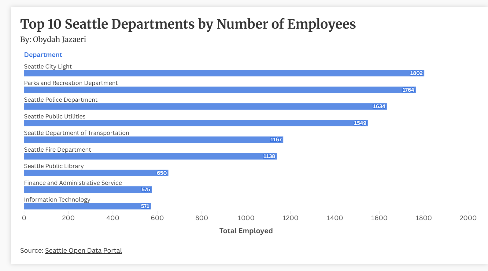

## First Flourish Viz
This data was taken from the Seattle Open Source Data Portal and contains data about Seattle wages which is originally sourced from the Seattle Department of Human Resources. To create the graph I took the total counts of those employed in each department listed and then just chose the top 10 for clearer and cleaner visualization. The bars are ranked from most employed to least and are each labeled with the number of employees in each department. Seattle City Light is the most popular department with 1,802, while Information Technology is ranked 10th with 571 employed. 

Source: https://data.seattle.gov/City-Administration/City-of-Seattle-Wage-Data/2khk-5ukd/about_data

Link to Flourish: [Top 10 Seattle Departments](https://public.flourish.studio/visualisation/28510081/)

## Graph:

Image Source: Obydah Jazaeri, (https://public.flourish.studio/visualisation/28510081/), April 13, 2026

 