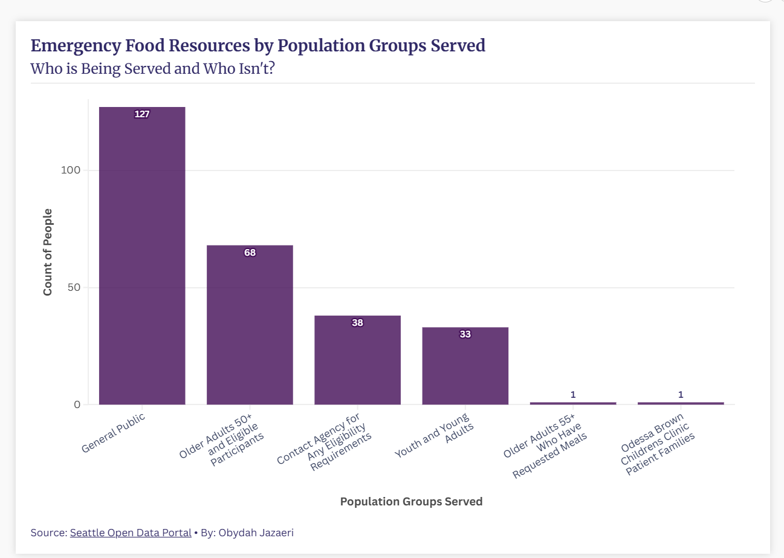

## Second Florish Visualization 
This data was taken from the Seattle Open Data Portal and contains data about the emergency food provided to people in Seattle and King County.  This information is originally sourced and  provided by the Human Resources Department. To create the graph I took the total counts of each population group receiving these meals. I then grouped certain categories like 50+, 55+, and 60+ into just one group of 50+ to make it easier to identify patterns. Lastly, I ranked the groups highest to lowest to make it more visually appealing.  I think this dataset is great for revealing gaps and limitations because although we are able to see certain groups there are still a lot of unanswered questions. For example what are the demographics of those in the 50+ group as well as the youth and young adults. Also, who is the general public, can that be anyone or are there things needed to qualify for these emergency meals provided? These questions could help make the dataset more thorough and allow for better analysis on who is receiving these meals and who is left out. 

Source: https://data.seattle.gov/Community-and-Culture/Emergency-Food-and-Meals-Seattle-and-King-County/kkzf-ntnu/about_data

Link to Flourish:[Emergency Food Resources by Population Groups Served](https://public.flourish.studio/visualisation/28641335/)

## Flourish Graph

Image Source: Obydah Jazaeri, (https://public.flourish.studio/visualisation/28641335/), April 19, 2026